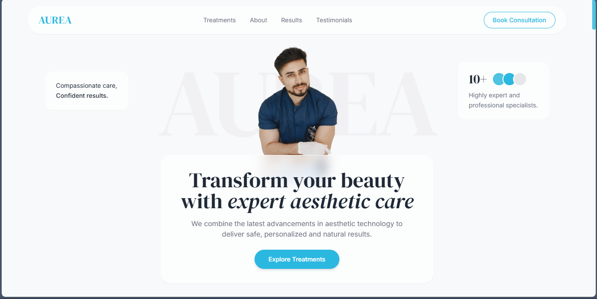

# 💎 AUREA — Premium Aesthetic Clinic

### Landing page premium para clínica estética de alto padrão

[**🔗 Demo ao vivo**](https://aurea-aesthetics.vercel.app/) 

---

## 📖 Sobre o Projeto

**AUREA** é uma landing page elegante e moderna desenvolvida para uma clínica estética premium. O projeto foi construído com foco em **experiência do usuário**, **performance** e **design sofisticado**, transmitindo a sensação de exclusividade e confiança que o público-alvo da marca espera.

A interface utiliza recursos visuais como **glassmorphism**, **animações suaves de scroll**, **microinterações** e uma **paleta de cores premium** baseada em tons de azul aqua, criando uma atmosfera de cuidado, modernidade e luxo.

---

## ✨ Funcionalidades

- 🎨 **Design Premium** — Interface moderna com glassmorphism e tipografia serifada elegante
- 📱 **Totalmente Responsivo** — Adaptado para mobile, tablet e desktop
- 🍔 **Menu Mobile** — Drawer lateral com overlay e transições suaves
- 🔄 **Toggle de Tratamentos** — Mostra/esconde cards adicionais com animação
- ❓ **FAQ Accordion** — Sistema de perguntas frequentes interativo
- 🪟 **Modal Instagram** — Confirmação antes de redirecionar para galeria externa
- 📝 **Formulário de Contato** — Estrutura completa para captura de leads
- ♿ **Acessibilidade** — Respeita `prefers-reduced-motion` e usa ARIA labels
- 🚀 **SEO Otimizado** — Meta tags, Open Graph e estrutura semântica
- ⚡ **Performance**

---

## 🛠️ Tecnologias Utilizadas

| Tecnologia | Função |
|------------|--------|
| **HTML5** | Estrutura semântica e acessível |
| **Tailwind CSS** | Estilização utility-first com config customizada |
| **JavaScript (Vanilla)** | Interações e funcionalidades |
| **Google Fonts** | Tipografia (DM Serif Display + Inter) |

---

## 🎨 Design System

### 🌈 Paleta de Cores

| Cor | Hex | Uso |
|-----|-----|-----|
|  Primary | `#2BB8E0` | Cor principal, CTAs, destaques |
|  Primary Light | `#4FC3E0` | Hover states, gradientes |
|  Primary Soft | `#E8F7FB` | Backgrounds suaves |
|  Title | `#1F2937` | Títulos e textos importantes |
|  Text | `#6B7280` | Corpo de texto |
|  Background | `#F8F9FA` | Backgrounds alternados |

### 🔤 Tipografia

- **Headings:** `DM Serif Display` — Serifada elegante e sofisticada
- **Body:** `Inter` — Sans-serif moderna e altamente legível

---

## 📑 Seções do Site

| # | Seção | Descrição |
|---|-------|-----------|
| 1 | **Hero** | Apresentação principal com cards flutuantes e CTA |
| 2 | **AUREA Standard** | Três pilares da marca (cuidado personalizado, equipamentos, especialistas) |
| 3 | **Treatments** | Portfólio de tratamentos com sistema "ver mais" |
| 4 | **About** | História da clínica com galeria de fotos |
| 5 | **Results** | Showcase de resultados antes/depois |
| 6 | **Testimonials** | Depoimentos de clientes |
| 7 | **FAQ** | Perguntas frequentes em accordion |
| 8 | **Contact** | Planos disponíveis + formulário de contato |
| 9 | **Footer** | Informações da marca, links e horários |
